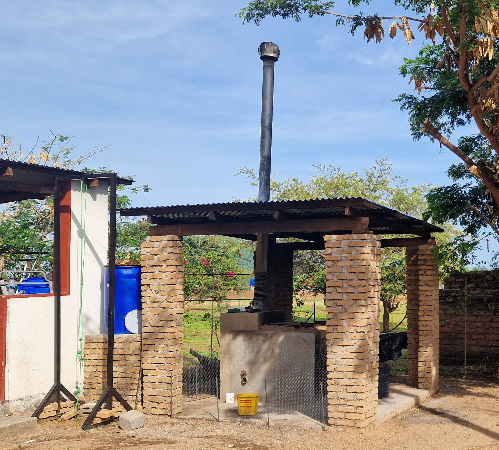

<!-- badges: start -->

<!-- badges: end -->

<h1> Incinerator construction and air quality monitoring data for Cape Maclear, Malawi </h1>

<b>Contributors</b>  
- Raphael Mignot-Bahisson <a href="https://orcid.org/0009-0004-6139-9243">
 0009-0004-6139-9243
</a> *author, maintainer*  
- Jakub Tkaczuk <a href="https://orcid.org/0000-0001-7997-9423">
 0000-0001-7997-9423
</a> *supervisor, developer*  
- Elizabeth Tilley <a href="https://orcid.org/0000-0002-2095-9724">
 0000-0002-2095-9724
</a> *supervisor*  

 

 

  
<b>Complete description of system design, functionalities, operation, and maintenance is available on: 
<a href="https://global-health-engineering.github.io/incinerate-with-hx/">Github pages</a>.
</b>
  
It compliments the openly-accessible master’s thesis, available on the   
<a href="">ETH Research Collection</a>.

# Background

Waste management in Cape Maclear, Malawi, is a critical issue due to the lack of formal collection services and reliance on open waste burning. This work supplements the thesis, which proposes improvements to two De Montfort Mark 8A incinerators and evaluates their impact on combustion efficiency and emissions reduction.

Key engineering upgrades included larger chimneys, additional air vents, structural reinforcements, a chimney cap, and the integration of a heat exchanger system. As a result, combustion temperatures increased from 663°C to 846°C at the Billy Riordan Memorial Clinic and from 372°C to 907°C at the waste deposit (managed by the NGO Sustainable Cape Maclear). The waste-to-ashes ratio also improved significantly, decreasing from 22.14\% to 10.17\% at the clinic and from 39.44\% to 17.11\% at the waste deposit, indicating more complete combustion.

To optimize waste handling, a sorting table and a lift were introduced for efficient separation of non-combustible materials, while a dedicated ash pit ensured safer disposal. Air quality monitoring showed a drastic reduction in PM1.0, PM2.5, and PM10 emissions, with concentrations falling below WHO guidelines, greatly improving local air quality.

Additionally, this repository presents the design of a heat exchanger mounted on the chimney of one of the incinerators to utilize waste heat and generate warm water without additional fuel or labor.

# Technical drawings

Technical drawings, necessary to replicate the construction are available as CAD models and in pdf form in `cad` directory.

# License

The complete design and user manual are licensed under [Creative Commons Attribution 4.0 International](https://github.com/Global-Health-Engineering/glass-crusher-design/blob/main/LICENSE.md).
